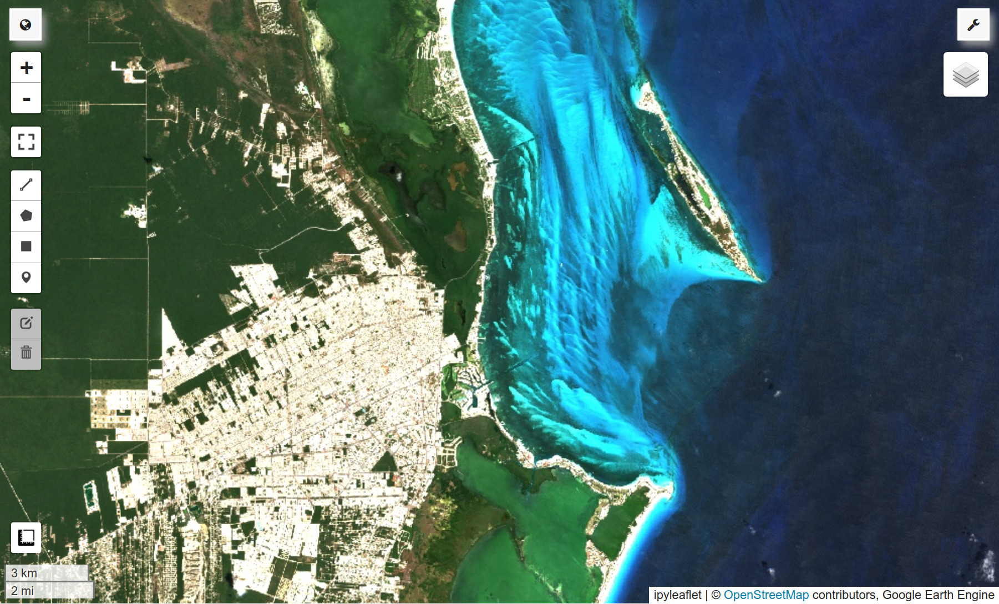

# Digital Image Processing for Remote Sensing

## <u>Course information</u>
This class is a general introduction to Digital Image Processing, with special focus on remote sensing applications using Google Earth Engine (GEE). It was taught at [UNAM](https://www.unam.mx/) (Universidad Nacional Autónoma de México) in 2024, as part of the *Licenciatura en Geografía Aplicada* in the [Escuela Nacional de Ciencias de la Tierra](https://www.encit.unam.mx/) (ENCIT). 

<small>Note: students enrolled in this course had no prior programming knowledge.</small>

    

## <u>Instructor</u>
Sébastien Valade ([UNAM](https://svalade.github.io/))

## <u>Part 1</u>: *fundamentals of Digital Image Processing*

### Introduction 
* Introduction ([slides](https://raw.githubusercontent.com/svalade/dip4rs/master/lectures/pdfs_2024/DIP4RS_00_introduction.pdf))
  
### Lecture 01
* Lecture: Python/Jupyter setup ([slides](https://raw.githubusercontent.com/svalade/dip4rs/master/lectures/pdfs_2024/DIP4RS_01_lecture.pdf))
* Tutorial: Python ([notebook](https://github.com/svalade/dip4rs/blob/master/exercises/01/DIP4RS_01_python-tutorial.ipynb))
* Tutorial: Jupyter ([notebook](https://github.com/svalade/dip4rs/blob/master/exercises/01/DIP4RS_01_jupyter-tutorial.ipynb))

### Lecture 02
* Lecture: Digital Image Basics ([slides](https://raw.githubusercontent.com/svalade/dip4rs/master/lectures/pdfs_2024/DIP4RS_02_lecture.pdf)) ([slides extra](https://raw.githubusercontent.com/svalade/dip4rs/master/lectures/pdfs_2024/DIP4RS_02_lecture_extra.pdf))
* Tutorial: Numpy ([notebook](https://github.com/svalade/dip4rs/blob/master/exercises/02/DIP4RS_02_numpy-tutorial.ipynb))
* Exercises: [notebook](https://github.com/svalade/dip4rs/blob/master/exercises/02/exercises.ipynb), [images](https://github.com/svalade/dip4rs/blob/master/exercises/02/exercises_images.zip)
* Exercises (solved): [notebook](https://github.com/svalade/dip4rs/blob/master/exercises/02/exercises_solved-live.ipynb)

### Lecture 03
* Lecture: Image Filtering ([slides](https://raw.githubusercontent.com/svalade/dip4rs/master/lectures/pdfs_2024/DIP4RS_03_lecture.pdf))
* Exercises: [notebook](https://github.com/svalade/dip4rs/blob/master/exercises/03/exercises.ipynb), [images](https://github.com/svalade/dip4rs/blob/master/exercises/03/exercises_images.zip)
* Exercises (solved): [notebook](https://github.com/svalade/dip4rs/blob/master/exercises/03/exercises_solved-live.ipynb)

### Lecture 04
* Lecture: Morphology and Segmention ([slides](https://raw.githubusercontent.com/svalade/dip4rs/master/lectures/pdfs_2024/DIP4RS_04_lecture.pdf))
* Exercises: [notebook](https://github.com/svalade/dip4rs/blob/master/exercises/04/exercises.ipynb), [images](https://github.com/svalade/dip4rs/blob/master/exercises/04/exercises_images.zip)
* Exercises (solved): [notebook](https://github.com/svalade/dip4rs/blob/master/exercises/04/exercises_solved-live.ipynb)

## <u>Part 2</u>: *remote sensing applications with Google Earth Engine (GEE)*

### Lecture 05
* Lecture: GEE Introduction ([slides](https://raw.githubusercontent.com/svalade/dip4rs/master/lectures/pdfs_2024/DIP4RS_05_lecture.pdf))
* Exercises: [notebook](https://github.com/svalade/dip4rs/blob/master/exercises/05/exercises.ipynb)

### Lecture 06
* Lecture: GEE Image Manipulation ([slides](https://raw.githubusercontent.com/svalade/dip4rs/master/lectures/pdfs_2024/DIP4RS_06_lecture.pdf))
* Exercises: [notebook](https://github.com/svalade/dip4rs/blob/master/exercises/06/exercises.ipynb)

### Lecture 07
* Lecture: GEE Image Classification ([slides](https://raw.githubusercontent.com/svalade/dip4rs/master/lectures/pdfs_2024/DIP4RS_07_lecture.pdf))
* Exercises: [notebook](https://github.com/svalade/dip4rs/blob/master/exercises/07/exercises.ipynb)

### Lecture 08
* Lecture: GEE Change Detection (naive images differencing) ([slides](https://raw.githubusercontent.com/svalade/dip4rs/master/lectures/pdfs_2024/DIP4RS_08_lecture.pdf))
* Exercises: [notebook](https://github.com/svalade/dip4rs/blob/master/exercises/08/exercises.ipynb)

### Lecture 09
* Lecture: GEE Timeseries ([slides](https://raw.githubusercontent.com/svalade/dip4rs/master/lectures/pdfs_2024/DIP4RS_09_lecture.pdf))
* Exercises: [notebook](https://github.com/svalade/dip4rs/blob/master/exercises/09/exercises.ipynb)

### Lecture 10
* Lecture: GEE Mosaicking and Compositing ([slides](https://raw.githubusercontent.com/svalade/dip4rs/master/lectures/pdfs_2024/DIP4RS_10_lecture.pdf))
<!-- * Exercises: [notebook](https://github.com/svalade/dip4rs/blob/master/exercises/10/exercises.ipynb) -->

### Extra
* PlanetScope in GEE ([slides](https://raw.githubusercontent.com/svalade/dip4rs/master/lectures/pdfs_2024/DIP4RS_extra_PlanetScope.pdf) by Dulce Ruiz)
* GOES16 in GEE ([notebook1](https://github.com/svalade/dip4rs/blob/master/exercises/GOES/GOES16_ash.ipynb), [notebook2](https://github.com/svalade/dip4rs/blob/master/exercises/GOES/GOES16_eclipse.ipynb) by Santiago Piñón Juárez)

## <u>Recommended Literature</u>
* Chuvieco, E. (2010). Teledetección ambiental
* Gonzalez R.C. & Woods, R.E. (2018). Digital Image Processing (4th Ed.)
* Lillesand, T., Kiefer, R. W., & Chipman, J. (2014). Remote sensing and image interpretation.
* Cardille J. A., et al. (2024). Cloud-Based Remote Sensing with Google Earth Engine
* Canty M. J. (2019). Image Analysis, Classification and Change Detection in Remote Sensing. CRC Press. 4th Edition